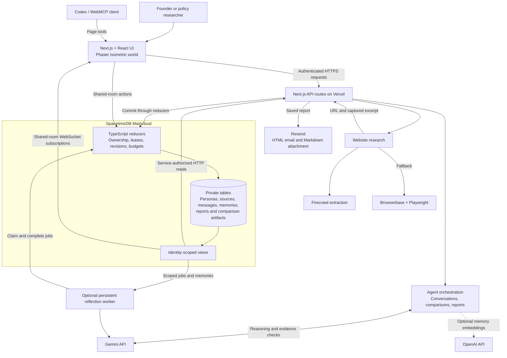

# Log kya bolenge

**Big questions. Little people.**

For founders deciding what to launch, charge or change: paste a product link, describe your audience and ask your hardest question. A population of AI residents explores the trade-offs, discusses objections and helps you decide what to test with real customers. The policy track applies the same workflow to Indian bills and public policy proposals.

[Try the app](https://log-kya-bolenge.vercel.app) · Built for the SpacetimeDB hackathon

The UI was inspired by [Claude City](https://github.com/mittal-parth/claude-clan).

## Explore a decision

1. Enter a name, a product or policy URL, and three short answers. The world opens after onboarding, without a password wall.
2. Start 12 Gemini residents. They work through 66 unique pairs, remembering earlier conversations and reflecting on whether their opinions changed.
3. Open a pixel speech bubble to read the discussion. Inspect individual residents and their memories.
4. Use **Try a change** to compare the original proposal with an alternative, using the same saved residents, evidence and starting memories. Each version receives a separate assessment.
5. Generate a report with source links, exact quoted passages, expandable conversations and suggested experiments. Download it or email a copy. Adding actual customer responses is optional.

The isometric world has a Bengaluru founder theme centred on Vidhana Soudha and a policy theme centred on India's Parliament. Lighting follows your local time, and the interface works on phones.

The landing page displays a public count of distinct browsers since visitor tracking began. Repeat visits from the same stored browser ID do not increase that count. Optional onboarding emails are saved privately for signup tracking and do not trigger email delivery. Both use SpacetimeDB; local and preview traffic is excluded from the public visitor total.

## Architecture



### Built on SpacetimeDB

SpacetimeDB makes this build unusually compact: durable state, transactional coordination and live shared-room updates live in one backend. It does the work that keeps the world consistent while the agents are thinking.

- Reducers check ownership, acquire leases, reject stale revisions and enforce request budgets before committing changes.
- Each conversation, message and memory has its own stored record. Comparison artifacts preserve the starting snapshot and save each assessment so retries can reuse completed work.
- Shared-room clients subscribe to identity-scoped views. A committed observation appears for other room members without a refresh.
- The database also coordinates the optional reflection worker through leased jobs. This implementation needs no Redis service.

The [TypeScript module](spacetimedb/src/index.ts) contains these rules. Gemini calls run outside the database, in API handlers or the persistent worker. The main private simulation updates through API responses; shared-room subscriptions are a separate flow in the same database. City movement is rendered locally.

### Memory, comparisons and evidence

Each speaker receives its own memories. After both messages, each resident records an opinion before, an opinion after and a reason. Retrieval uses lexical relevance and recency, with optional OpenAI embeddings; agreement is never compulsory.

A comparison freezes the brief, evidence, population and existing memories. Original and changed assessments cannot see one another's answers. The UI shows decisions, reasons and trade-offs by resident name. Progress is stored after each assessment, and reports can also be generated from comparison results alone.

Report findings link to captured source passages or the relevant simulated discussion. Exact quotes must occur in the captured excerpt. A separate Gemini call checks factual claims for support, contradiction or insufficient evidence. Optional customer responses remain labelled as user-reported observations, separate from the frozen predictions.

## Run locally

Use Node.js 22 or later, npm and the [SpacetimeDB CLI](https://spacetimedb.com/docs/).

```sh
npm ci
# For a fresh checkout only; preserve an existing .env.
cp .env.example .env
npm run dev
```

Open [localhost:3001](http://localhost:3001). The illustrative world works without provider keys. Live agents require your own database and credentials.

Install the module dependencies and publish to your Maincloud database:

```sh
npm --prefix spacetimedb ci
spacetime publish your-database-name --module-path spacetimedb --server maincloud --delete-data=never
spacetime generate --module-path spacetimedb --lang typescript --out-dir src/lib/spacetime/generated --yes
```

Set both browser and server database connection variables in `.env`. Register a dedicated backend identity through the publisher-only `authorize_simulation_service` reducer, then set its token as `SPACETIMEDB_SERVICE_TOKEN`. The [module](spacetimedb/src/index.ts) and [generated reducer binding](src/lib/spacetime/generated/authorize_simulation_service_reducer.ts) define that authorization contract. Keep the service token on the server.

For a local database, run `spacetime start --listen-addr 127.0.0.1:3000`, publish with `--server http://127.0.0.1:3000`, and use `ws://127.0.0.1:3000` for both connection URIs.

### Configuration

[.env.example](.env.example) lists the supported settings.

| Feature | Configuration |
| --- | --- |
| Browser database connection | `NEXT_PUBLIC_SPACETIMEDB_URI`, `NEXT_PUBLIC_SPACETIMEDB_DATABASE` |
| Private simulation storage | `SPACETIMEDB_URI`, `SPACETIMEDB_DATABASE`, authorized `SPACETIMEDB_SERVICE_TOKEN` |
| Gemini agents | `GEMINI_API_KEY`, `GEMINI_MODEL`, `ENABLE_AGENT_INFERENCE=true` |
| Website capture | `ENABLE_PRODUCT_INGESTION=true`, `FIRECRAWL_API_KEY` |
| Browser fallback | `BROWSERBASE_API_KEY`, `BROWSERBASE_PROJECT_ID` |
| Optional memory embeddings | `OPENAI_API_KEY`, `OPENAI_EMBEDDING_MODEL` |
| Report email | `RESEND_API_KEY`, `EMAIL_FROM` |
| Optional reflection worker | `SPACETIMEDB_WORKER_TOKEN`; run `npm run worker:agents` |

The room owner must authorize the reflection worker's printed public identity before it can process jobs. Run that worker as a persistent process, separately from Vercel. Its local token files stay in ignored `.worldline/` storage.

Set the same server environment variables in Vercel for a hosted deployment. Secrets must never use the `NEXT_PUBLIC_` prefix.

## Development

```sh
npm test
npm run typecheck
npm run backend:check
npm run build
```

With a local database running and the module published, `RUN_SPACETIME_INTEGRATION=1 npm test` enables the shared-client integration checks. Those checks are skipped by default.

| Location | Responsibility |
| --- | --- |
| `src/components/worldline/` | Onboarding, world controls, comparisons and reports |
| `src/game/` | Isometric rendering, landmarks, sprites and lighting |
| `src/app/api/` | Authenticated simulation, research, export and email routes |
| `src/lib/agents/` | Gemini conversations, memory selection and evidence checks |
| `src/lib/experiments/` | Frozen comparisons and decision assessments |
| `spacetimedb/src/` | Database schema, reducers, views and authorization |
| `scripts/agent-worker.ts` | Persistent shared-room reflection worker |
| `tests/` | Behavioral, evidence, storage and rendering checks |

On supported Codex clients, [WebMCP](https://learn.chatgpt.com/docs/webmcp) exposes onboarding, population creation, conversation and report actions through the current browser session. Paid actions use the same authenticated API routes as the interface.
